So before we start Kubernetes. We need to understand about docker and container. So I am going to give the cliche definition of these 2 terms :smiley:
# What is docker
**Definition** - Docker is a set of platform as a service products that use OS-level virtualization to deliver software in packages called containers. Containers are isolated from one another and bundle their own software, libraries and configuration files; they can communicate with each other through well-defined channels.
## What is container
**Definition** - A container is a standard unit of software that packages up code and all its dependencies so the application runs quickly and reliably from one computing environment to another.

Yeah I am pretty sure that by going through above defition you might be thinking if this is how you are going to compile your learnings then I am done man. But bear with me, I bet you will start loving me at the end :relaxed:

So putting above terms in layman terms. Docker is container management tool and container is a light weight independent environment to run your application.

For understanding Docker and container we have to learn basics of File System and Kernels.

### What is file system?
**Definition** Collections of file and directories for specific purpose.

#### Boot file system
The Boot File System (named BFS on Linux, but BFS also refers to the Be File System) was used on UnixWare to store files necessary to its boot process.

#### Root file system
The root filesystem is the top-level directory of the filesystem. It must contain all of the files required to boot the Linux system before other filesystems are mounted. It must include all of the required executables and libraries required to boot the remaining filesystems.
**Folders** - /bin, /boot, /dev, /etc, /home, /lib, /media, /mnt, /opt, /root, /sbin, /tmp, /usr, /var

#### File system in user space
Filesystem in Userspace (FUSE) is a software interface for Unix and Unix-like computer operating systems that lets non-privileged users create their own file systems without editing kernel code.

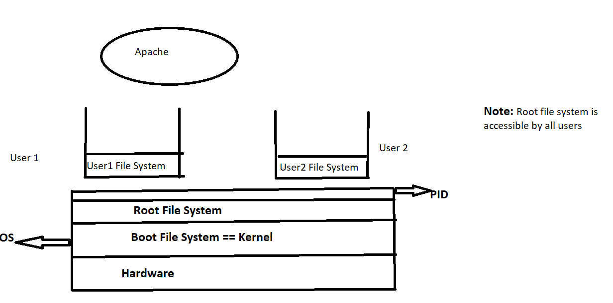

### What is a kernel
**Definition** - The kernel is a computer program at the core of a computer's operating system that has complete control over everything in the system. It is the "portion of the operating system code that is always resident in memory", and facilitates interactions between hardware and software components.

### Different linux Kernels
- Cgroup
- Namespaces
- Capablilities - Decides root or non root
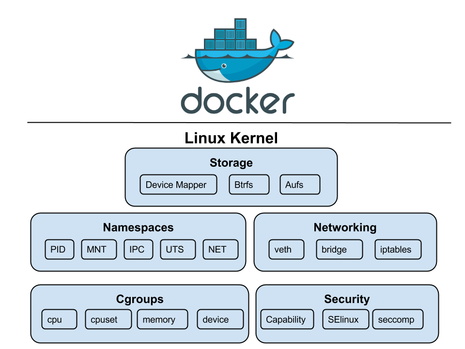
#### Linux kernel namespace types
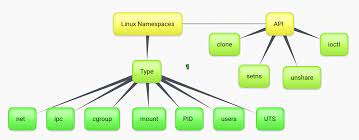
##### Cgroup:
**Definition** - cgroups (abbreviated from control groups) is a Linux kernel feature that limits, accounts for, and isolates the resource usage (CPU, memory, disk I/O, network, etc.) of a collection of processes.

##### mount:
**Definition** - Mount namespaces are a powerful and flexible tool for creating per-user and per-container filesystem trees.

##### PID:
**Definition** - The PID namespace provides processes with an independent set of process IDs (PIDs) from other namespaces.PID namespaces are nested, meaning when a new process is created it will have a PID for each namespace from its current namespace up to the initial PID namespace. Hence the initial PID namespace is able to see all processes.
The first process created in a PID namespace is assigned the process id number 1 and receives most of the same special treatment as the normal init process, most notably that orphaned processes within the namespace are attached to it. This also means that the termination of this PID 1 process will immediately terminate all processes in its PID namespace and any descendants.
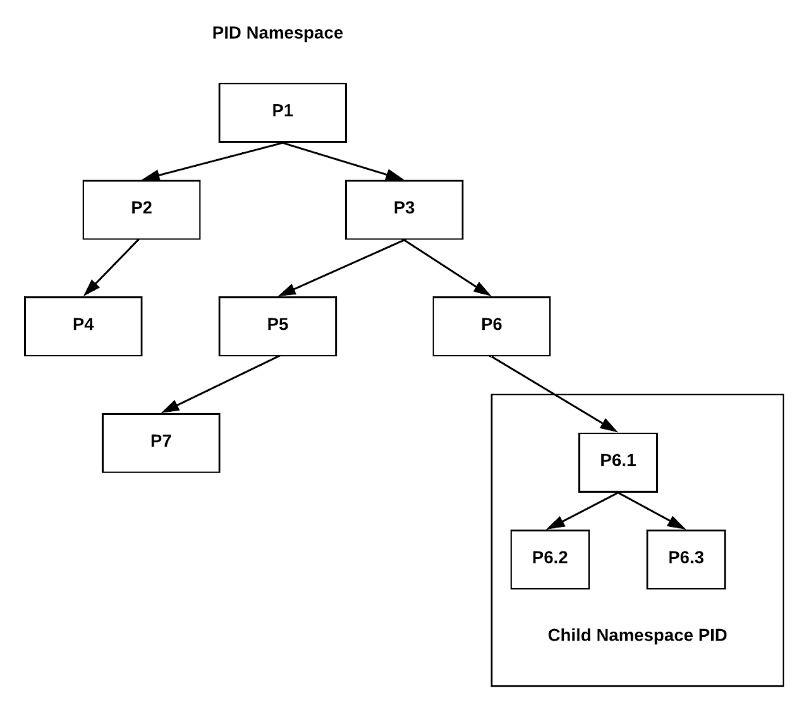

##### NET:
Network namespaces virtualize the network stack. On creation a network namespace contains only a loopback interface.

Each network interface (physical or virtual) is present in exactly 1 namespace and can be moved between namespaces.

Each namespace will have a private set of IP addresses, its own routing table, socket listing, connection tracking table, firewall, and other network-related resources.

Destroying a network namespace destroys any virtual interfaces within it and moves any physical interfaces within it back to the initial network namespace.

### Components needed to run an application
Hardware
    OS
        Kernal
            Namespace
|        | Needed | Allowed by OS | Can |
| ------ | ------ | ------------- | --- |
|     **User**    | 1 | Multiple | Multiple |
| **RFS aka MNT** | 1 |     1    | Multiple |
|      **PID**    | 1 |     1    | Multiple |
|     **NET**     | 1 |     1    | Multiple |

**Why OS does not allow for multiple PID, NET, MNT?**
Because of Personal computing concept. Initially system was made with personal workspace in mind. And for 1 person only 1 is enough.

### Problem of VM:
- Need of heavy weight hypervisor
- Repeatitive Operating System
- Repeatitive run time env ( Java, Tomcat etc)
- Repeatitive -> PID, RFS, NET

### Problem of Personal Computing:
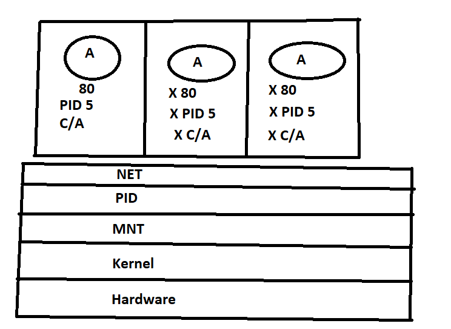

**_NOTE:_** We can not load balance on port level on PC ( For different instance of same application we are bound to host it on different PORT, same PORT can not be assigned to 2 different process in PID tree ). So we have to get rid off personal computing.

### Proposed solution:
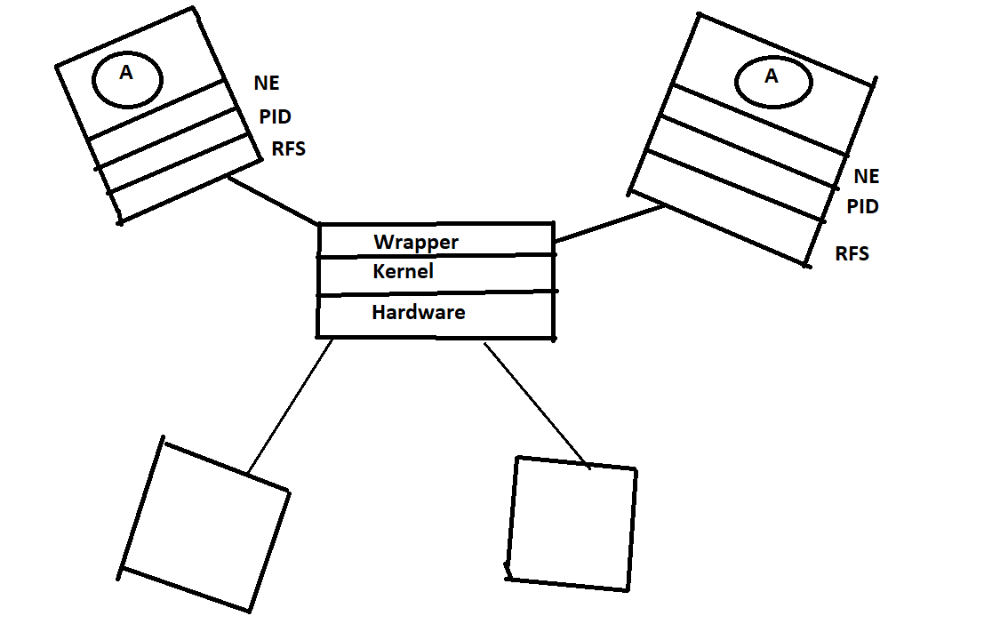
Now you can create as many users as many you want. The above **wrapper is nothing but docker** which directly talks to kernel and it will create NE, PID, RFS for each user )

#### Revised defition of container:
Light weight fully independent Application run time environment.
A container is an application of -
- One NET
- One PID
- One RFS to each user

### Docker architecture (Docker Engine):
===========================================================
**Human --> Docker client --> Rest API --> Docker Server --> ContainerD --> Kernel**
===========================================================

**ContainerD** - An industry standard container runtime.

### Docker components:
1. ##### Docker Engine
2. ##### Docker Image
    Difference between VMs Image and Docker Image
    VM image contains -  BOOTFS + ROOTFS + USERFS + APPFS
    Docker image contains - ROOTFS + USERFS + APPFS
    **_NOTE:_** - One copy of Docker image get mounted to each user aka container.
       From one image you can create multiple containers.
       Ex: ubuntu image = RFS + UFS
           jenkins = RFS + UFS + java + jenkins
3. ##### Registry
    It contains different version of file system
            - ROOT FS
            - USER FS
            - APP FS
    Public repository example - hub.docker.com, google registry
    Private repository example - Nexus, Artifactory
4. ##### Docker container
    **Human --> Client --> Server --> Containerd --> Kernel**
    With container creation of 1 NET and 1 PID takes place.
    Container creates one mount using docker image
    &&& Create one user
    &&& Attach - Network, PID, MOUNT to the USER

### Docker workflow:
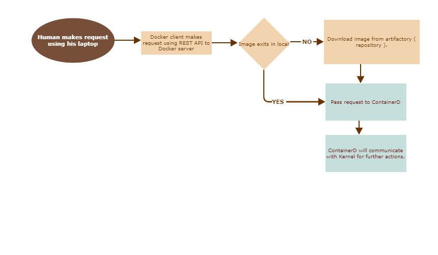

### VM LifeCycle:
**Create -> Start -> STOP -> Start -> Restart -> Pause -> Unpause -> KILL -> remove**

### Container LifeCycle:
**Create -> Start -> STOP -> Start -> Restart -> Pause -> Unpause -> KILL -> remove**

### How to install Docker?
**Commands to install and check docker**
```sh
1. vi /etc/ssh/sshd_config
2. passwd centos
3. systemctl restart sshd
4. sudo yum install -y yum-utils device-mapper-persistent-data lvm2
5. sudo yum install -y yum-utils device-mapper-persistent-data lvm2
6. sudo yum-config-manager --add-repo https://download.docker.com/linux/centos/docker-ce.repo
7. sudo yum install –y https://dl.fedoraproject.org/pub/epel/epel-release-latest-7.noarch.rpm
8. sudo yum-config-manager --enable rhui-REGION-rhel-server-extras
9. sudo yum install -y docker-ce
10. docker -v
11. sudo systemctl enable docker
12. sudo systemctl start docker
13. docker info
14. which docker
15. ps -eaf | grep docker
16. which containerd
```

> Note: `DOCKER NEED ROOT` to send a command
or
USER need to be part of `group called "docker"`

### Container LifeCycle commands:
```sh
1. docker create --name=<name_of_container> public_image
2. docker start <container_id>
3. docker stop <container_id>
4. docker start <container_id>
5. docker restart <container_id>
6. docker pause <container_id>
7. docker unpause <container_id>
8. docker kill <container_id>
9. docker rm <container_id>
```

#### Difference b/w Stop and Kill:
**Stop** - It attempts to trigger a graceful shutdown by sending stanndard POSIX signal ( SIGTERM ). SIGTERM signal is sent to process to request its termination. It can be caught and interpreted or ignored by the process.  SIGTERM allows nice termination of process ( releasing resource and saving state if appropriate ).

**KILL** - It sends SIGKILL signal which forces process for immediate termination. SIGKILL can never be ignored.

#### Difference b/w pause and unpause:
**Pause** - It stops all the processes running inside container.
**Unpause** - It unpause all the processes within one or more containers.

Now if you followed completely I am pretty sure that many concepts are clear as crytal in your mind. I know there must be many doubts and there should be gray area in this documentation. I suggest you to do research on those until you become comfortable and please also share with me. Eager to hear back :relaxed:

### How to use the container ?
**Run --> Pull --> Create --> Start --> Become a container** (by default PID1 will be attached to container)

> Note1: `Physical server is running` as long as PID1 is running.
`Virtual Server` is running as long as PID1 is running.
`Container` is running as long as PID1 is running.

> Note2: `For Physical Server` -> PID1 is SYSTEMD.
`For virtual server` -> PID1 is SYSTEMD.
`For container` -> PID1 can be **anything** ( java, perl, python, /bin/bash, /bin/tini etc )

### How to go inside a container?
**Method 1 - using exec**
1. It would execute any executable inside a container
2. But using -it with /bin/bash (any shell you can use ) you can access the terminal of container.

**Method 2 - using attach**
Command -
```sh
docker attach <container_id>
```
This command will attach PID1 to container. When you will do CTRL + C it will bring down the container because you are killing PID1 process and container can not exist without PID1.

> Note: For getting IP address of container - `docker inspect <container_id>`. It will give private **IP address**.

### Port Forwarding ( For accessing container from outside ):
**Command**:
```
docker run -d -p 8080:8080 jenkins/jenkins
```

I know you are not going to learn different commands of docker. So let me put details of some of the docker command.
1. **diff** - Inspect changes to files or directories on a container's filesystem. `docker diff <container_id>`
2. **inspect** - Return low-level information on Docker objects. You can inspect Container, Image etc.
3. **port** - It list the port mapping for container. `docker port <container_id>`
4. **rename** - Rename container according to your convenience. `docker rename <container_id> salman`
5. **update** - Dynamically update container configurations.
**Ex** - `docker update --cpu-shares 512 -m 300M <container_id>`
6. **wait** - Block until one or more containers stop, then pring their exit code. `docker wait container <container_id>`.
**Monitoring container commands**
7. **logs** - This gives log of PID1 process.
8. **stats** - Statistics of container
`docker stats` - CPU, MEM Usage/Limit, MEM%, NETWORK I/O, CPU, RAM, DISK, NETWORK etc
9. **top** - (PID tree of container on host machine). Display the running processes of a container. `docker top <container_id>`
10. **events** - It monitors docker server ( docker daemon logs ).

You can get details of any command by using this format - `docker command --help` for ex - `docker wait --help`

### Close look on Docker Images:
**Image** - Collecions of file system layered over each other.
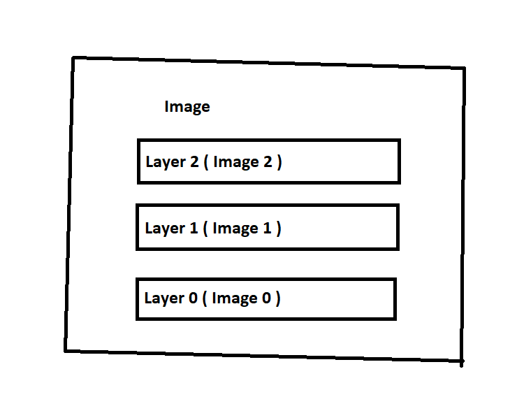

In Docker Layer 0 is always **ROOT FS**
> Note1: Higher layers always win when there is conflict in layers.
> Note2: Image layering is accomplished through Union Mount.
> Note3: When we create a container - All the layers get merged into ONE
		MOUNTED TO Container Process.
#### Union Mount:
Unification of filesystems is the concept of **mounting several filesystems on a single mount point**, with the resulting mount showing the logical combination of all the filesystems. In the kernel, the filesystems are stacked in order of their mount sequence, the first mounted filesystem is at the bottom of the mount stack, and the latest mount is at the top of the stack. Only the **files and directories of the top of the mount stack are visible**.

Too boring right?? :laughing: . Let's understand with an example

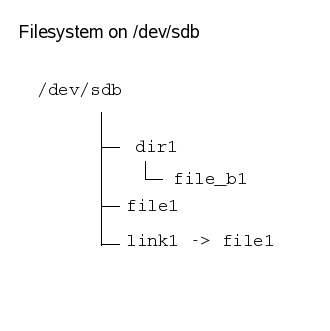 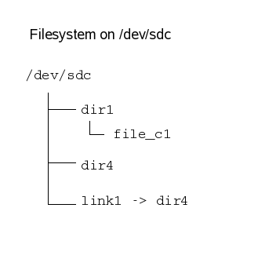

Issuing the following commands will perform a union mount:

    # mount /dev/sdb /mnt
    # ls /mnt
    dir1 file1 link1

    # mount --union /dev/sdc /mnt
    # ls /mnt
    dir1 dir4 file1 link1
After the union, the directory structure looks like:

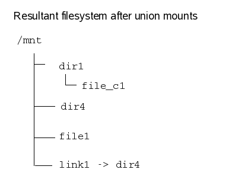

> Note: Container will get all layers of image as merged folder ( using above union mount algorithm ). Once container got stopped this merged folder will also get deleted automatically. This allocation happens dynamically at run time.

**docker start, stop** - docker daemon will automatically trigger union mount

**docker kill and rm** - merged folder and init folder will be deleted automatically.


